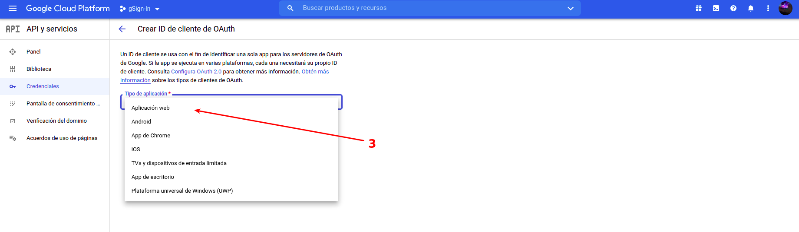
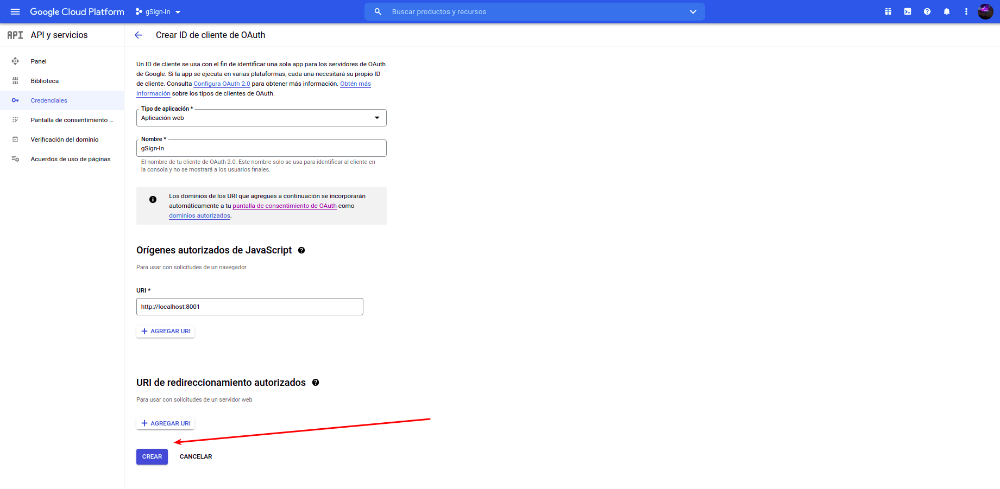
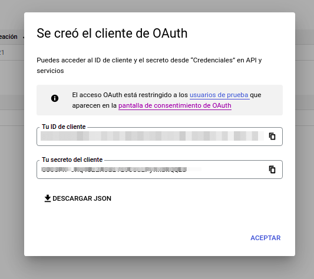
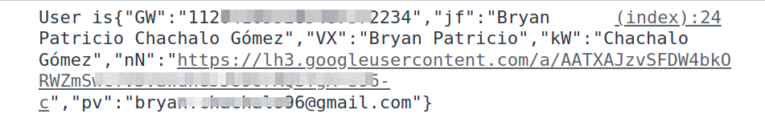

# Google Sign-In for Websites

GOAL: Retrieve user information (name, email, id) from Google ID provider.
This document describes how to complete a basic Google Sign-In integration.
 [Reference](https://developers.google.com/identity/sign-in/web)

Google Sign-In has announce his deprecation of the JavaScript library for web apps and it plans to fully retire it on `March 31, 2023.`

For a complete overview on how to migrate to Google Identity Services SDKs [clic here](https://developers.google.com/identity/gsi/web/guides/migration)


Information about Google Sign-In migration to [Google SDKs](https://developers.googleblog.com/2021/08/gsi-jsweb-deprecation.html)

***

## _Integrating Google Sign-In into your web app_

## Create authorization credentials

Any application that uses OAuth 2.0 to access Google APIs must have authorization credentials that identify the application to Google's OAuth 2.0 server. The following steps explain how to create credentials for your project. Your applications can then use the credentials to access APIs that you have enabled for that project.

- Go to the [Credentials page](https://console.developers.google.com/apis/credentials).
- Click **Create credentials > OAuth client ID.**

- Select the **Web application** application type.

- Name your OAuth 2.0 client and click Create


After configuration is complete, take note of the client ID that was created. You will need the client ID to complete the next steps. (A client secret is also created, but you need it only for server-side operations.)


## Load the Google Platform Library

You must include the Google Platform Library on your web pages that integrate Google Sign-In.

```html
<script src="https://apis.google.com/js/platform.js" async defer></script>
```
## Specify your app's client ID

Specify the client ID you created for your app in the Google Developers Console with the google-signin-client_id meta element.

```html
<meta name="google-signin-client_id" content="YOUR_CLIENT_ID.apps.googleusercontent.com">
```

>Note: You can also specify your app's client ID with the client_id parameter of the gapi.auth2.init() method.

## Add a Google Sign-In button

The easiest way to add a Google Sign-In button to your site is to use an automatically rendered sign-in button. With only a few lines of code, you can add a button that automatically configures itself to have the appropriate text, logo, and colors for the sign-in state of the user and the scopes you request.

To create a Google Sign-In button that uses the default settings, add a div element with the class **g-signin2** to your sign-in page:

```html
<div class="g-signin2" data-onsuccess="onSignIn"></div>
```

## **Get profile information**

After you have signed in a user with Google using the default scopes, you can access the user's Google ID, name, profile URL, and email address.

To retrieve profile information for a user, use the **getBasicProfile()** method.

```js
function onSignIn(googleUser) {
  var profile = googleUser.getBasicProfile();
  console.log('ID: ' + profile.getId()); // Do not send to your backend! Use an ID token instead.
  console.log('Name: ' + profile.getName());
  console.log('Image URL: ' + profile.getImageUrl());
  console.log('Email: ' + profile.getEmail()); // This is null if the 'email' scope is not present.
}
```

>Important: Do not use the Google IDs returned by getId() or the user's profile information to communicate the currently signed in user to your backend server. Instead, send ID tokens, which can be securely validated on the server.

## Sign out a user
You can enable users to sign out of your app without signing out of Google by adding a sign-out button or link to your site. To create a sign-out link, attach a function that calls the **GoogleAuth.signOut()** method to the link's onclick event.

```html
<a href="#" onclick="signOut();">Sign out</a>
<script>
  function signOut() {
    var auth2 = gapi.auth2.getAuthInstance();
    auth2.signOut().then(function () {
      console.log('User signed out.');
    });
  }
</script>
```

## Authenticate with a backend server 

If you use Google Sign-In with an app or site that communicates with a backend server, you might need to identify the currently signed-in user on the server. To do so securely, after a user successfully signs in, send the user's ID token to your server using HTTPS. Then, on the server, verify the integrity of the ID token and use the user information contained in the token to establish a session or create a new account.

## Send the ID token to your server

After a user successfully signs in, get the user's ID token:

```js
function onSignIn(googleUser) {
  var id_token = googleUser.getAuthResponse().id_token;
  ...
}
```

Then, send the ID token to your server with an HTTPS POST request:

```js
var xhr = new XMLHttpRequest();
xhr.open('POST', 'https://yourbackend.example.com/tokensignin');
xhr.setRequestHeader('Content-Type', 'application/x-www-form-urlencoded');
xhr.onload = function() {
  console.log('Signed in as: ' + xhr.responseText);
};
xhr.send('idtoken=' + id_token);
```

## Example of information retrieved printed to the console

After configuration of google-auth you can use your client id and run the sample as follow:

` pip install simple-http-server `

`python -m http.server 8001 --bind localhost`

Now open localhost:8001 in your browser and open console to get the information about the user.



***

# Verify the integrity of the ID token

After you receive the ID token by HTTPS POST, you must verify the integrity of the token.

To verify that the token is valid, ensure that the following criteria are satisfied:

- The ID token is properly signed by Google. Use Google's public keys (available in [JWK](https://www.googleapis.com/oauth2/v3/certs) or [PEM](https://www.googleapis.com/oauth2/v1/certs) format) to verify the token's signature. These keys are regularly rotated; examine the **Cache-Control** header in the response to determine when you should retrieve them again.
- The value of aud in the ID token is equal to one of your app's client IDs. This check is necessary to prevent ID tokens issued to a malicious app being used to access data about the same user on your app's backend server.
- The value of iss in the ID token is equal to accounts.google.com or https://accounts.google.com.
- The expiry time (exp) of the ID token has not passed.
- If you want to restrict access to only members of your G Suite domain, verify that the ID token has an hd claim that matches your G Suite domain name.

Rather than writing your own code to perform these verification steps, we strongly recommend using a Google API client library for your platform, or a general-purpose JWT library. For development and debugging, you can call our tokeninfo validation endpoint.

# Using a Google API Client Library

Using one of the Google API Client Libraries (e.g. Java, Node.js, PHP, Python) is the recommended way to validate Google ID tokens in a production environment.

### Java

To validate an ID token in Java, use the [GoogleIdTokenVerifier](https://github.com/googleapis/google-api-java-client/blob/master/google-api-client/src/main/java/com/google/api/client/googleapis/auth/oauth2/GoogleIdTokenVerifier.java) object. For example:

```java
import com.google.api.client.googleapis.auth.oauth2.GoogleIdToken;
import com.google.api.client.googleapis.auth.oauth2.GoogleIdToken.Payload;
import com.google.api.client.googleapis.auth.oauth2.GoogleIdTokenVerifier;

...

GoogleIdTokenVerifier verifier = new GoogleIdTokenVerifier.Builder(transport, jsonFactory)
    // Specify the CLIENT_ID of the app that accesses the backend:
    .setAudience(Collections.singletonList(CLIENT_ID))
    // Or, if multiple clients access the backend:
    //.setAudience(Arrays.asList(CLIENT_ID_1, CLIENT_ID_2, CLIENT_ID_3))
    .build();

// (Receive idTokenString by HTTPS POST)

GoogleIdToken idToken = verifier.verify(idTokenString);
if (idToken != null) {
  Payload payload = idToken.getPayload();

  // Print user identifier
  String userId = payload.getSubject();
  System.out.println("User ID: " + userId);

  // Get profile information from payload
  String email = payload.getEmail();
  boolean emailVerified = Boolean.valueOf(payload.getEmailVerified());
  String name = (String) payload.get("name");
  String pictureUrl = (String) payload.get("picture");
  String locale = (String) payload.get("locale");
  String familyName = (String) payload.get("family_name");
  String givenName = (String) payload.get("given_name");

  // Use or store profile information
  // ...

} else {
  System.out.println("Invalid ID token.");
}
```

### Node.js

To validate an ID token in Node.js, use the [Google Auth Library for Node.js](https://github.com/google/google-auth-library-nodejs). Install the library:

```js
npm install google-auth-library --save
Then, call the verifyIdToken() function. For example:

const {OAuth2Client} = require('google-auth-library');
const client = new OAuth2Client(CLIENT_ID);
async function verify() {
  const ticket = await client.verifyIdToken({
      idToken: token,
      audience: CLIENT_ID,  // Specify the CLIENT_ID of the app that accesses the backend
      // Or, if multiple clients access the backend:
      //[CLIENT_ID_1, CLIENT_ID_2, CLIENT_ID_3]
  });
  const payload = ticket.getPayload();
  const userid = payload['sub'];
  // If request specified a G Suite domain:
  // const domain = payload['hd'];
}
verify().catch(console.error);
```

### PHP
To validate an ID token in PHP, use the [Google API Client Library for PHP](https://github.com/google/google-api-php-client/). Install the library (for example, using Composer):

```php
composer require google/apiclient
Then, call the verifyIdToken() function. For example:

require_once 'vendor/autoload.php';

// Get $id_token via HTTPS POST.

$client = new Google_Client(['client_id' => $CLIENT_ID]);  // Specify the CLIENT_ID of the app that accesses the backend
$payload = $client->verifyIdToken($id_token);
if ($payload) {
  $userid = $payload['sub'];
  // If request specified a G Suite domain:
  //$domain = $payload['hd'];
} else {
  // Invalid ID token
}
```

### Python

To validate an ID token in Python, use the [verify_oauth2_token](https://google-auth.readthedocs.io/en/latest/reference/google.oauth2.id_token.html#google.oauth2.id_token.verify_oauth2_token) function. For example:

```python
from google.oauth2 import id_token
from google.auth.transport import requests

# (Receive token by HTTPS POST)
# ...

try:
    # Specify the CLIENT_ID of the app that accesses the backend:
    idinfo = id_token.verify_oauth2_token(token, requests.Request(), CLIENT_ID)

    # Or, if multiple clients access the backend server:
    # idinfo = id_token.verify_oauth2_token(token, requests.Request())
    # if idinfo['aud'] not in [CLIENT_ID_1, CLIENT_ID_2, CLIENT_ID_3]:
    #     raise ValueError('Could not verify audience.')

    # If auth request is from a G Suite domain:
    # if idinfo['hd'] != GSUITE_DOMAIN_NAME:
    #     raise ValueError('Wrong hosted domain.')

    # ID token is valid. Get the user's Google Account ID from the decoded token.
    userid = idinfo['sub']
except ValueError:
    # Invalid token
    pass

```

> The GoogleIdTokenVerifier.verify() method verifies the JWT signature, the aud claim, the iss claim, and the exp claim. \nIf you want to restrict access to only members of your G Suite domain, also verify the hd claim by checking the domain name returned by the Payload.getHostedDomain() method.


Calling the tokeninfo endpoint
An easy way to validate an ID token signature for debugging is to use the tokeninfo endpoint. Calling this endpoint involves an additional network request that does most of the validation for you while you test proper validation and payload extraction in your own code. It is not suitable for use in production code as requests may be throttled or otherwise subject to intermittent errors.

To validate an ID token using the tokeninfo endpoint, make an HTTPS POST or GET request to the endpoint, and pass your ID token in the id_token parameter. For example, to validate the token "XYZ123", make the following GET request:


```
https://oauth2.googleapis.com/tokeninfo?id_token=XYZ123
```
If the token is properly signed and the iss and exp claims have the expected values, you will get a HTTP 200 response, where the body contains the JSON-formatted ID token claims. Here's an example response:

```js
{
 // These six fields are included in all Google ID Tokens.
 "iss": "https://accounts.google.com",
 "sub": "110169484474386276334",
 "azp": "1008719970978-hb24n2dstb40o45d4feuo2ukqmcc6381.apps.googleusercontent.com",
 "aud": "1008719970978-hb24n2dstb40o45d4feuo2ukqmcc6381.apps.googleusercontent.com",
 "iat": "1433978353",
 "exp": "1433981953",

 // These seven fields are only included when the user has granted the "profile" and
 // "email" OAuth scopes to the application.
 "email": "testuser@gmail.com",
 "email_verified": "true",
 "name" : "Test User",
 "picture": "https://lh4.googleusercontent.com/-kYgzyAWpZzJ/ABCDEFGHI/AAAJKLMNOP/tIXL9Ir44LE/s99-c/photo.jpg",
 "given_name": "Test",
 "family_name": "User",
 "locale": "en"
}
```

> Warning: Once you get these claims, you still need to check that the aud claim contains one of your app's client IDs. If it does, then the token is both valid and intended for your client, and you can safely retrieve and use the user's unique Google ID from the sub claim.

If you are a G Suite customer, you might also be interested in the hd claim, which indicates the hosted domain of the user. This can be used to restrict access to a resource to only members of certain domains. The absence of this claim indicates that the user does not belong to a G Suite hosted domain.

## Create an account or session

After you have verified the token, check if the user is already in your user database. If so, establish an authenticated session for the user. If the user isn't yet in your user database, create a new user record from the information in the ID token payload, and establish a session for the user. You can prompt the user for any additional profile information you require when you detect a newly created user in your app.

## Securing your users' accounts with Cross Account Protection

When you rely on Google to sign in a user, you'll automatically benefit from all of the security features and infrastructure Google has built to safeguard the user's data. However, in the unlikely event that the user's Google Account gets compromised or there is some other significant security event, your app can also be vulnerable to attack. To better protect your accounts from any major security events, use Cross Account Protection to receive security alerts from Google. When you receive these events, you gain visibility into important changes to the security of the user's Google account and you can then take action on your service to secure your accounts.

---

# Google Sign-In JavaScript client reference 

This reference describes the JavaScript client methods and to manage `GoogleUsers` attributes.

If you need a complete reference (methods: Auth setup, Authentication, UI elements, advanced) follow the [google's reference overview](https://developers.google.com/identity/sign-in/web/reference#users).

## Users

A `GoogleUser` object represents one user account. `GoogleUser` objects are typically obtained by calling GoogleAuth.currentUser.get().

### GoogleAuth.currentUser.get()

Returns a `GoogleUser` object that represents the current user. Note that in a newly-initialized GoogleAuth instance, the current user has not been set. Use the currentUser.listen() method or the GoogleAuth.then() to get an initialized GoogleAuth instance.

**Returns**
**`GoogleUser`**:
The current user

### GoogleAuth.currentUser.listen(listener)

Listen for changes in currentUser.

**Arguments**
**`listener`**
A function that takes a `GoogleUser` parameter. listen passes this function a `GoogleUser` instance on every change that modifies currentUser.

### GoogleUser.getId()

Get the user's unique ID string.

> Do not use the Google IDs returned by getId() to communicate the currently signed in user to your backend server. Instead, send ID tokens, which can be securely validated on the server.

**Returns**
**`String`**
The user's unique ID

### GoogleUser.isSignedIn()

Returns true if the user is signed in.

**Returns**
**`Boolean`**
True if the user is signed in

### GoogleUser.getHostedDomain()

Get the user's G Suite domain if the user signed in with a G Suite account.

**Returns**
**`String`**
The user's G Suite domain

### GoogleUser.getGrantedScopes()

Get the scopes that the user granted as a space-delimited string.

**Returns**
**`String`**
The scopes granted by the user

### GoogleUser.getBasicProfile()

Get the user's basic profile information.

> Do not use the user's profile information to communicate the currently signed in user to your backend server. Instead, send ID tokens, which can be securely validated on the server.
**Returns**
**`gapi.auth2.BasicProfile`**
You can retrieve the properties of gapi.auth2.BasicProfile with the following methods:

- BasicProfile.getId()
- BasicProfile.getName()
- BasicProfile.getGivenName()
- BasicProfile.getFamilyName()
- BasicProfile.getImageUrl()
- BasicProfile.getEmail()

### GoogleUser.getAuthResponse(includeAuthorizationData)

Get the response object from the user's auth session.

**Arguments**
**`includeAuthorizationData`**
> **Optional**: A boolean that specifies whether to always return an access token and scopes. By default, the access token and requested scopes are not returned when fetch_basic_profile is true (the default value) and no additional scopes are requested.
**Returns**
**`gapi.auth2.AuthResponse`**
A `gapi.auth2.AuthResponse` object.

### GoogleUser.reloadAuthResponse()

Forces a refresh of the access token, and then returns a Promise for the new AuthResponse.

**Returns**
**`Promise`**
A Promise that is fulfilled with the reloaded `gapi.auth2.AuthResponse` when reloading the OAuth token is done.

### gapi.auth2.AuthResponse
The response returned when calling `GoogleUser.getAuthResponse`(_**includeAuthorizationData**_) or `GoogleUser.reloadAuthResponse()` methods.

**Properties**
**`access_token`** string
The Access Token granted.
*``id_token``* string
The ID Token granted.
**`scope`**string
The scopes granted in the Access Token.
**`expires_in`** number
The number of seconds until the Access Token expires.
**`first_issued_at`** number
The timestamp at which the user first granted the scopes requested.
**`expires_at`** number
The timestamp at which the Access Token will expire.

### GoogleUser.hasGrantedScopes(scopes)

Returns true if the user granted the specified scopes.

**Arguments**
**`scopes`**
A space-delimited string of scopes.
**Returns**
**`Boolean`**
True if the scopes were granted

### GoogleUser.grant(_**options**_)

Request additional scopes to the user.

See `GoogleAuth.signIn()` for the list of parameters and the error code.

### GoogleUser.grantOfflineAccess(options)

Get permission from the user to access the specified scopes offline.

**Arguments**
**`options`**
A `gapi.auth2.OfflineAccessOption`s object containing key-value pairs of parameters. For example:

```js
{
  scope: 'profile email'
}
```

### GoogleUser.disconnect()

Revokes all of the scopes that the user granted for the application.

***

## Google API Services User Data Policy 

To known better about terms of services when you request access to Google APIs, you can read the [Google API Services User Data Policy](https://developers.google.com/terms/api-services-user-data-policy).

## OAuth2 Google Apis

To get the Scompe of all listed Apis provided by Google go to [OAuth2 Scopes](https://developers.google.com/identity/protocols/oauth2/scopes)